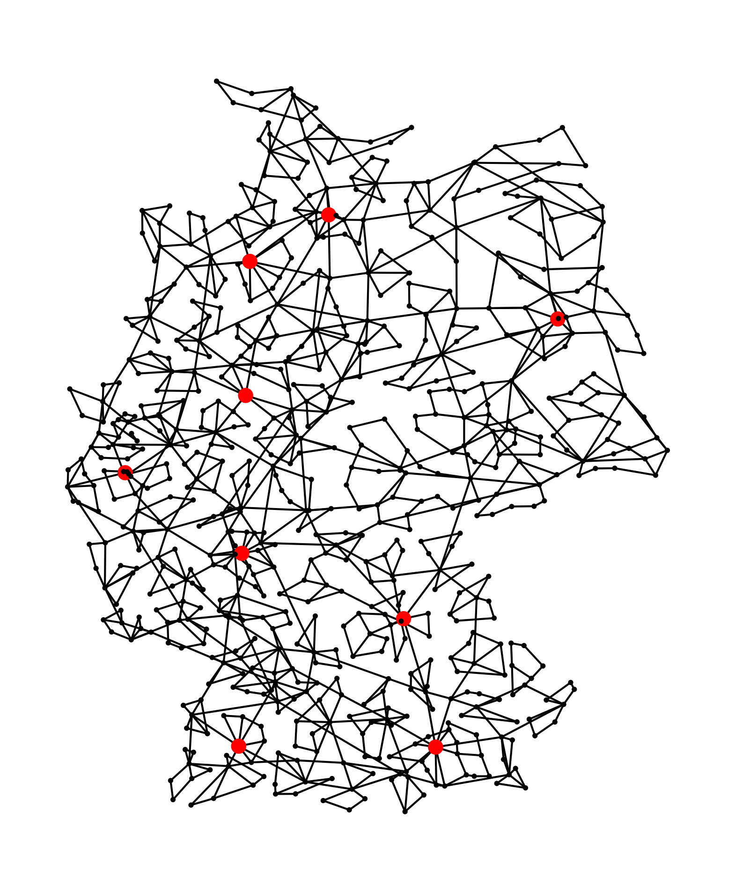
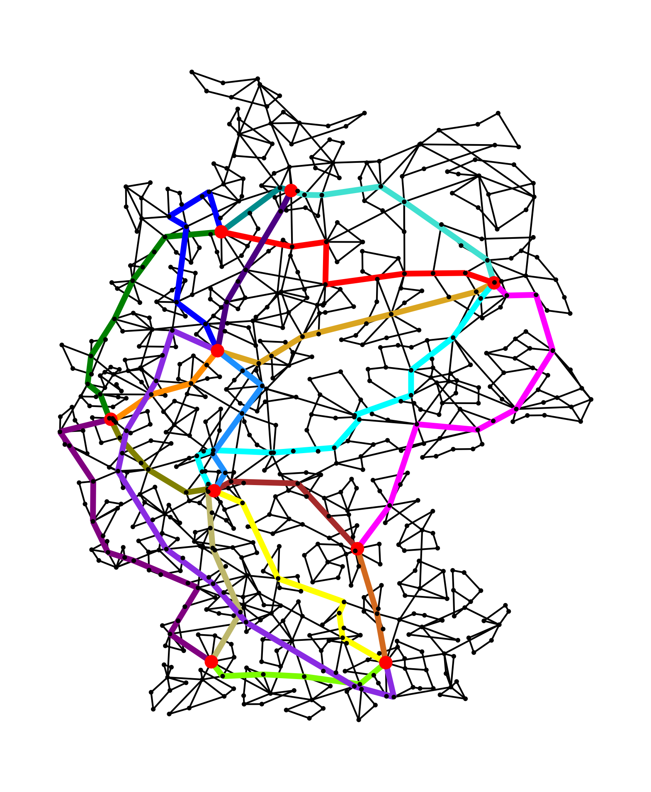

The MCDPP describes the following problem: For a given undirected graph with
non-negative edge costs and a certain number of node pairs,
paths are to be found on the graph between the node pairs. These paths
must not intersect. The goal is to find the embedded paths for all node
pairs with the minimum total cost. The undirected graph is called base graph
and the node pairs are described as an undirected demand graph.

There is currently no known algorithm that solves this problem in polynomial time.
The MCDPP is an integer linear optimization problem, that can be solved
using a Branch and Bound algorithm. This Branch and Bound algorithm is implemented
in C++ and can be used as an Windows MCDPP.exe program.

Also big instances can be solved in a short amount of time.

For more information visit the streamlit website.
